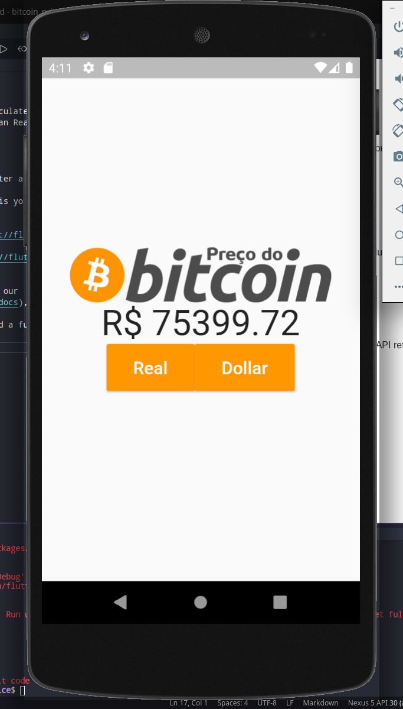

# bitcoin_price

>A new Flutter application. The app must calculate the price of bitcoin from BRL currency (Brazilian Real) and USD (American Dollar).

This app whas made to practice my skills in Flutter Language. 

#Meta

Júnior Nunes 

[linkedin](https://www.linkedin.com/in/j%C3%BAnior-nunes-35a525170/)

denisonprobable13@gmail.com

[GitHub](https://github.com/jnunes-ds)